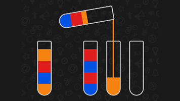
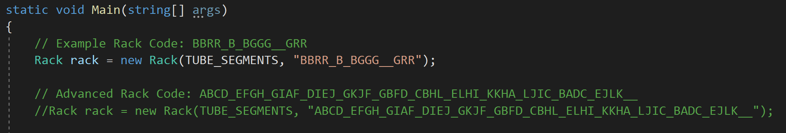

# Water Sort - Color Puzzle Game
AI agent for solving "Water Sort" mobile puzzle game

### "Water Sort" is a puzzle game where tubes are filled with colored water and it the player's goal to sort them all into like-colors.

### Water data is passed in the form of a string of "color" characters

### Algorithm will check the current state of the game and calculate a "score" for how close the game is to being solved.

### The agent will generate the steps required for the user to complete the game that you can follow from the initial state of the game 
