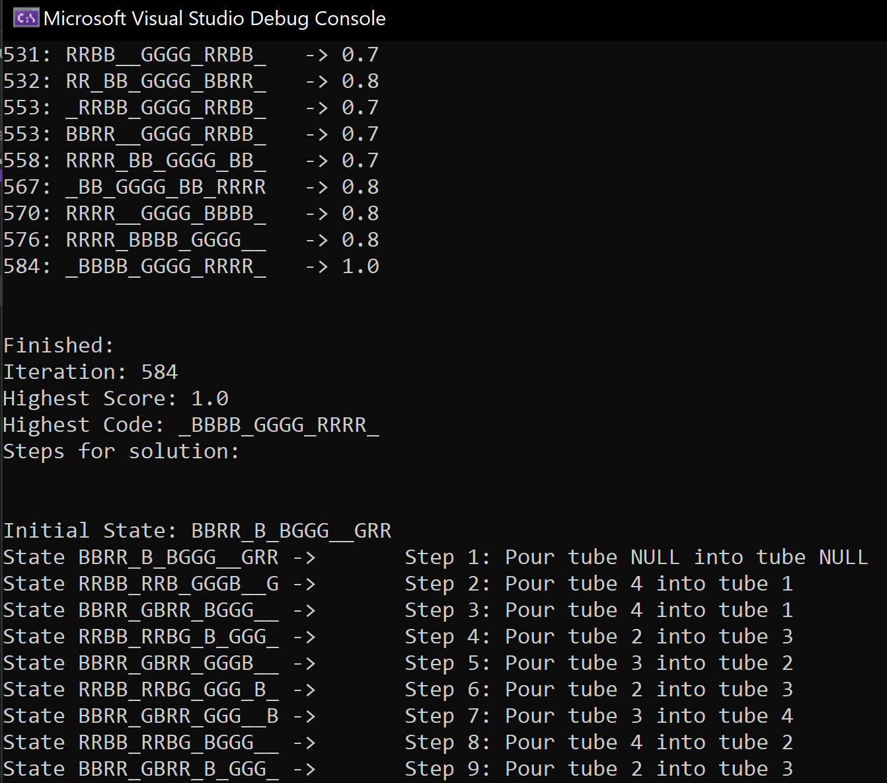

# Water Sort - Color Puzzle Game
## AI agent for solving "Water Sort" mobile puzzle game

"Water Sort" is a puzzle game where tubes are filled with colored water and is the player's goal to sort them all into like-colors.

Water data is passed in the form of a string of "color" characters

Algorithm will check the current state of the game and calculate a "score" for how close the game is to being solved. Once probability reaches 1.0, a solved state has been reached!

The agent will generate the steps required for the user to complete the game that can be followed from the initial state to the solved state. 

Some updates need to be made to eliminate redundancies in the solving methods, however the solved state will be reached for smaller tube/rack sets.
